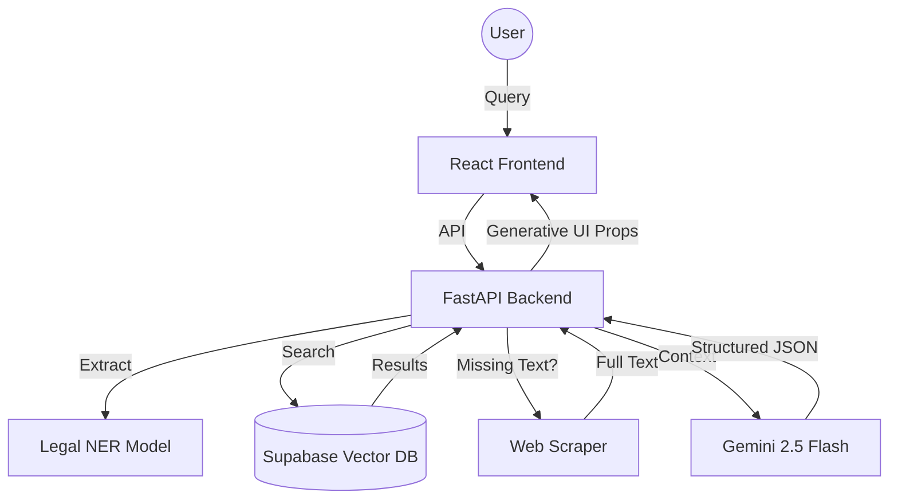

<div align="center">
  <br />
  <h1>🏛️ NyayaFlow</h1>
  <p><b>The Compassionate Legal Companion for the Digital Era</b></p>
  <p>
    <a href="#-key-features">Features</a> •
    <a href="#-tech-stack">Stack</a> •
    <a href="#-getting-started">Setup</a> •
    <a href="#-architecture">Architecture</a>
  </p>
</div>
---
## 🌟 Overview
NyayaFlow is a first-of-its-kind **"Generative UI" Legal Workbench**. It transforms complex courtroom statutes and procedures into empathetic, human-readable insights. Powered by **Gemini 2.5 Flash** and a custom **Legal RAG (Retrieval-Augmented Generation)** pipeline, it acts as a supportive senior partner for researchers and litigants alike.
> [!NOTE]
> **NyayaFlow AI Persona**: Unlike traditional cold legal tools, NyayaFlow is designed with high emotional intelligence. It acknowledges the stress of legal situations, matches user language (Hindi/English/Hinglish), and prioritizes human warmth alongside legal accuracy.
---
## ✨ Key Features
### 🧠 Intelligent Legal Research (RAG)
- **Deep Context Search**: Vector-based search over the IPC, CrPC, and live legal acts.
- **Smart Web Retrieval**: Automatically fetches and caches full-text judgments from sources like *Indian Kanoon* when snippet data is insufficient.
- **Legal NER**: On-device entity extraction using the `en_legal_ner_trf` model to identify Courts, Statutes, and Precedents.
### 🍱 Generative UI (Perplexity-Style)
- **Source Summary Pills**: Beautiful, interactive reference navigation that summarizes citations.
- **Dynamic Widgets**:
  - 📖 **Statute Cards**: Clean displays of original law vs. simple explanations.
  - 🍎 **Penalty Alerts**: Visual "Red Cards" for offenses and punishments.
  - ⏳ **Procedure Timelines**: Step-by-step visualizations of legal processes.
### 🎨 Design & Experience
- **Modern Aesthetic**: Glassmorphic UI with zinc-themed palettes and fluid animations.
- **Multi-lingual Intelligence**: Seamlessly switch between English, Hindi, and Hinglish.
---
## 🛠️ Tech Stack
- **Frontend**: React 18, Vite, Tailwind CSS, Framer Motion, Lucide React.
- **Backend**: Python 3.13, FastAPI, Uvicorn.
- **AI/ML**: Gemini 2.5 Flash (via LangChain), Google Text-Embeddings-004.
- **Data Engineering**: Supabase (PostgreSQL + pgvector), Spacy (Legal NER), Kaggle Datasets.
- **Scraping**: BeautifulSoup4 + Custom Scraper Service.
---
## 🚀 Getting Started
### Prerequisites
- Node.js (v18+)
- Python (v3.10+)
- Supabase Account (with pgvector enabled)
- Google AI Studio API Key
### Backend Setup
1. Create a virtual environment:
   ```bash
   python -m venv .venv
   source .venv/bin/activate
   ```
2. Install requirements:
   ```bash
   pip install -r V2/backend/requirements.txt
   python -m spacy download en_legal_ner_trf
   ```
3. Configure `.env` in `V2/backend/`:
   ```env
   GOOGLE_API_KEY=your_key
   SUPABASE_URL=your_url
   SUPABASE_SERVICE_KEY=your_key
   ```
4. Start the server:
   ```bash
   cd V2/backend
   python server.py
   ```
### Frontend Setup
1. Install dependencies:
   ```bash
   cd V2
   npm install
   ```
2. Run the development server:
   ```bash
   npm run dev
   ```
---
## 🏗️ Architecture

---
## 📜 License
Distributed under the MIT License. See `LICENSE` for more information.
<div align="center">
  <p>Built with ❤️ for the Indian Legal Community</p>
</div>
