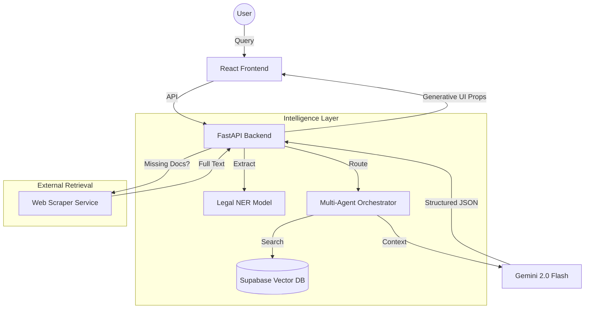

<div align="center">
  <br />
  
  
  
  <br />
  <h1>🏛️ NyayaFlow</h1>
  <p><b>The World's First Generative-UI Legal Intelligence System</b></p>
  <p>
    <a href="#-key-features">Features</a> •
    <a href="#-tech-stack">Stack</a> •
    <a href="#-getting-started">Setup</a> •
    <a href="#-architecture">Architecture</a>
  </p>
</div>

---

## 🌟 Overview

**NyayaFlow** is a first-of-its-kind **"Generative UI" Legal Workbench** designed specifically for the Indian legal ecosystem. It transforms complex courtroom statutes and convoluted procedures into empathetic, human-readable insights. Powered by **Gemini 2.0 Flash** and a sophisticated **Legal RAG (Retrieval-Augmented Generation)** pipeline, it acts as a supportive senior partner for researchers, advocates, and startup founders alike.

> [!IMPORTANT]
> **NyayaFlow AI Persona**: Unlike traditional cold legal tools, NyayaFlow is designed with high emotional intelligence. It acknowledges the stress of legal situations, matches user language (Hindi/English/Hinglish), and prioritizes human warmth alongside uncompromising legal accuracy.

---

## ✨ Key Features

### 🧠 Intelligent Legal Research (RAG)
- **Persona-Aware Retrieval**: Dual-mode intelligence that suppresses complex case law for **Founders** while providing deep technical citations for **Advocates**.
- **Deep Context Search**: Multi-agent vector search over IPC/BNS, CrPC, and specialized Indian Acts.
- **Smart Web Retrieval**: Automatically fetches and caches full-text judgments from sources like *Indian Kanoon* when snippet data is insufficient.
- **Legal NER**: On-device entity extraction to identify Courts, Statutes, and Precedents automatically.

### 🍱 Generative UI (Perplexity-Style)
- **Source Summary Pills**: Interactive reference navigation that summarizes citations at a glance.
- **Dynamic Legal Widgets**:
  - 📖 **Statute Cards**: Side-by-side display of original legal text vs. plain-English explanations.
  - 🍎 **Penalty Alerts**: Visual "Red Cards" highlighting offenses, punishments, and fine limits.
  - ⏳ **Procedure Timelines**: Step-by-step interactive visualizations of courtroom processes.
  - 🛑 **Safety Boundary Layer**: Intelligent risk detection for founders with "Consult Lawyer" escalations.

### 🎨 Design & Experience
- **Modern Aesthetic**: Glassmorphic UI with zinc-themed palettes, premium typography (Overused Grotesk), and fluid Framer Motion animations.
- **Multi-lingual Intelligence**: Seamless language switching between English, Hindi, and Hinglish for natural legal consultation.

---

## 🛠️ Tech Stack

### AI & Core Intelligence
- **LLM**: Google Gemini 2.0 Flash (via LangChain)
- **Embeddings**: Google Text-Embeddings-004
- **NER**: Spacy `en_legal_ner_trf` (Transformer-based Legal Model)

### Frontend Engine
- **Framework**: React 18 + Vite
- **Styling**: Tailwind CSS + Vanilla CSS (Premium Finish)
- **Animations**: Framer Motion
- **Icons**: Iconoir & Lucide React

### Backend Infrastructure
- **Framework**: Python 3.13 + FastAPI
- **Database**: Supabase (PostgreSQL + pgvector for semantic search)
- **Scraping**: BeautifulSoup4 + Custom Legal Browser Service

---

## 🚀 Getting Started

### Prerequisites
- Node.js (v18+)
- Python (v3.13+)
- Supabase Account (with pgvector enabled)
- Google AI Studio API Key

### Backend Setup
1. Create a virtual environment:
   ```bash
   python -m venv .venv
   source .venv/bin/activate
   ```
2. Install dependencies:
   ```bash
   pip install -r backend/requirements.txt
   python -m spacy download en_legal_ner_trf
   ```
3. Configure `.env` in `backend/`:
   ```env
   GOOGLE_API_KEY=your_key
   SUPABASE_URL=your_url
   SUPABASE_SERVICE_KEY=your_key
   ```
4. Launch the API:
   ```bash
   cd backend
   python server.py
   ```

### Frontend Setup
1. Install dependencies:
   ```bash
   npm install
   ```
2. Launch the developer server:
   ```bash
   npm run dev
   ```

---

## 🏗️ Architecture



---

## 📜 License
Distributed under the MIT License. See `LICENSE` for more information.

<div align="center">
  <p>Built with ❤️ for the Indian Legal Community</p>
</div>
