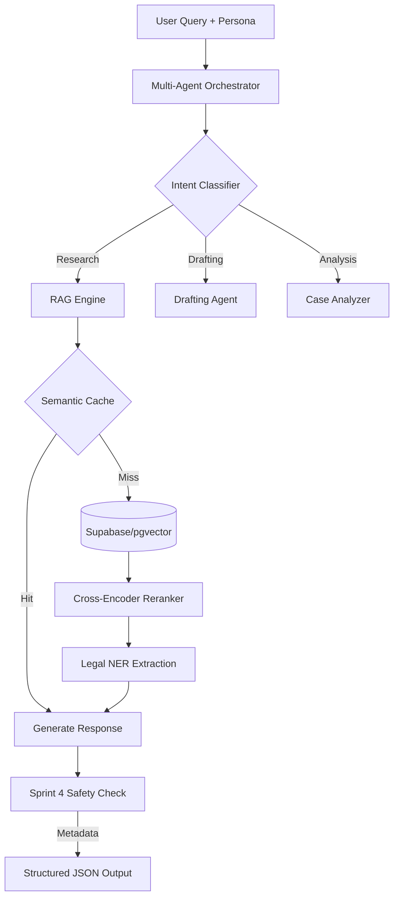

<div align="center">
  <br />
  <h1>🏛️ NyayaFlow Backend</h1>
  <p><b>The Multi-Agent Legal Intelligence Core</b></p>
  <p>
    <a href="#-key-features">Features</a> •
    <a href="#-tech-stack">Stack</a> •
    <a href="#-getting-started">Setup</a> •
    <a href="#-architecture">Architecture</a>
  </p>
</div>

---

## 🌟 Overview

The **NyayaFlow Backend** is a sophisticated legal intelligence engine powered by a **Multi-Agent Orchestrator** and a **Legal RAG (Retrieval-Augmented Generation)** pipeline. It serves as the "brain" for the NyayaFlow platform, transforming raw legal data into structured, empathetic, and actionable insights.

> [!NOTE]
> **Orchestration Excellence**: Unlike standard RAG systems, NyayaFlow uses an intelligent router to classify legal intent and dispatch queries to specialized agents (Statute Expert, Case Analyzer, Procedure Guide) ensuring the highest accuracy for both Advocates and Founders.

---

## ✨ Key Features

### 🧠 Intelligent Legal Research (RAG)
- **Multi-Agent Routing**: Automatically identifies if a user needs statutory explanation, case law analysis, or procedural guidance.
- **Sprint 4 Safety Layer**: Dynamic risk assessment (High/Medium/Low) with confidence scoring, jurisdiction-specific warnings, and auto-generated "Lawyer Handoff" briefs.
- **Legal NER & Extraction**: High-precision extraction of Courts, Statutes, and case entities using specialized Transformer models.

### 🍱 Generative Intelligence
- **Structured Response Schema**: Returns specific props for Generative UI widgets (Statute Cards, Penalty Alerts, Timelines).
- **Magic Auto-Fill**: Extracts case entities (Amounts, Dates, Names) from chat conversations to pre-fill legal templates.
- **Founder-Optimized Logic**: Automatically suppresses complex case law for non-lawyers while providing "Bottom Line" business impact summaries.

### 🛡️ Safety & Reliability
- **Citations First**: Every claim is grounded in retrieved PDF sources with zero-hallucination prompts.
- **Semantic Cache**: Sub-200ms response times for frequently asked legal questions.

---

## 🛠️ Tech Stack

- **Core**: Python 3.13, FastAPI, Uvicorn (Async Processing).
- **LLM & Embeddings**: Gemini 2.5 Flash (via LangChain), Google Text-Embeddings-004.
- **Orchestration**: Custom LangChain-based Multi-Agent system.
- **Vector Intelligence**: Supabase (pgvector) for production, ChromaDB for local development.
- **NLP**: Spacy (`en_legal_ner_trf`) for legal entity recognition.
- **Data Pipeline**: BeautifulSoup4 + Custom Scraper Service for real-time judgment retrieval.

---

## 🚀 Getting Started

### Prerequisites
- Python 3.10+
- Supabase Account (with pgvector enabled)
- Google AI Studio API Key

### Backend Setup
1. **Clone & Virtual Env**:
   ```bash
   python -m venv .venv
   source .venv/bin/activate
   ```
2. **Install Dependencies**:
   ```bash
   pip install -r requirements.txt
   python -m spacy download en_legal_ner_trf
   ```
3. **Configure Environment**:
   Create a `.env` file in the root:
   ```env
   GOOGLE_API_KEY=your_key
   SUPABASE_URL=your_url
   SUPABASE_SERVICE_KEY=your_key
   ```
4. **Launch Engine**:
   ```bash
   # Use the optimized startup script
   ./start.sh 
   
   # Or run directly
   python server.py
   ```

---

## 🏗️ Architecture



---

## 📡 API Endpoints

- `POST /api/research` - Primary entry point for legal queries.
- `POST /api/draft/generate` - Template-based document drafting.
- `GET /api/agents/status` - Real-time status of the multi-agent network.

---

## 📜 License
Internal Development - Copyright NyayaFlow 2026.

<div align="center">
  <p>Built with ❤️ for the Indian Legal Community</p>
</div>
